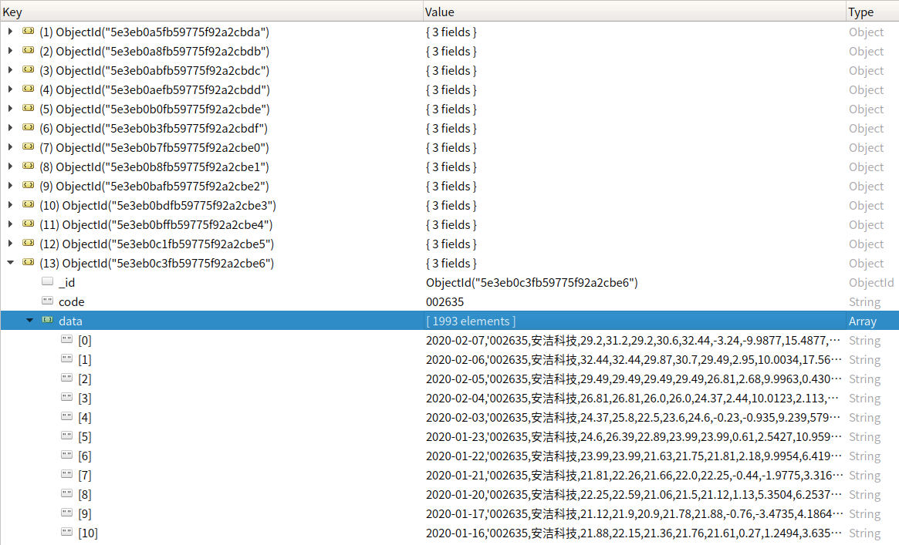
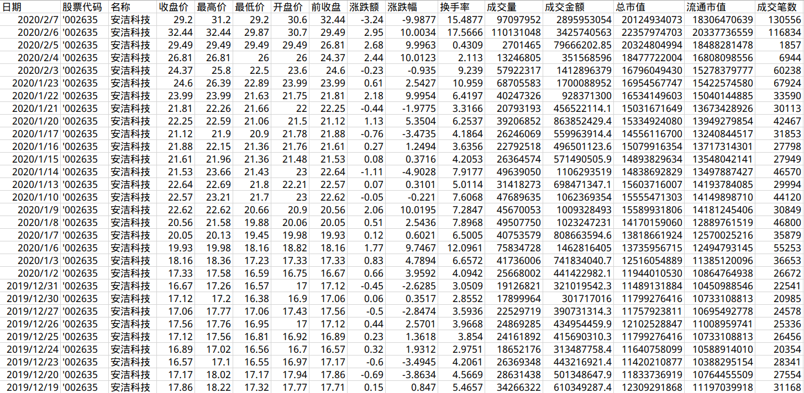

### 东方财富网沪深A股分布式爬虫

**实际是两个爬虫：**

StockList部分用于爬取股票数据下载链接存入redis

StockData部分从redis中获取下载链接并将数据存入MongoDB

**已经实现的功能：**

- 分布式爬取

- 随机用户代理

- 爬取完成自动停止

**待完善的功能：**

- 随机IP

- Zookeeper集群监控

- 邮件提醒

### 项目部署

笔者采用三个节点器来爬取数据，OS都为Ubuntu18.04。一个节点放StockList部分，其他两个节点（理论上可以任意多个）放StockData部分。环境配置采用Anaconda3，需要先安装[Redis](https://github.com/Linuscn/stockCrawler/blob/master/redisIntsall.md)和[MongoDB](https://github.com/Linuscn/stockCrawler/blob/master/mongoInstall.md)。

1.将开始链接（stock:start_url）写入Redis

```
sadd stock:start_url http://2.push2.eastmoney.com/api/qt/clist/get?&pn=1&pz=20&po=1&np=2&fltt=2&fid=f3&fs=m:0+t:6,m:0+t:13,m:0+t:80&fields=f12,f14 

sadd stock:start_url http://94.push2.eastmoney.com/api/qt/clist/get?&pn=1&pz=20&po=1&np=2&fltt=2&fid=f3&fs=m:1+t:2&fields=f12,f14
```

2.爬取股票数据下载链接

进入StockList目录下执行：

```
scrapy crawl stocklist
```

3.爬取股票数据到MongoDB

分别进入StockData目录下执行：

```
scrapy crawl stockdata
```

4.MongoDB数据

考虑到爬取速度，所有数据存入一个集合，每支股票数据对应一个文档



data字段对应数据格式如下

